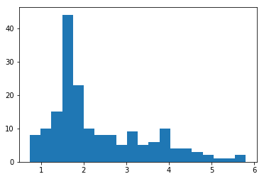
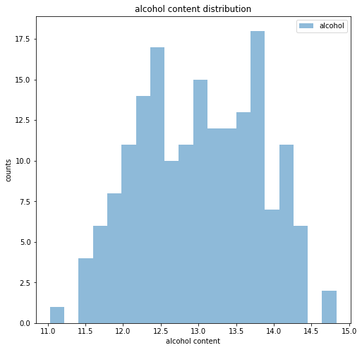
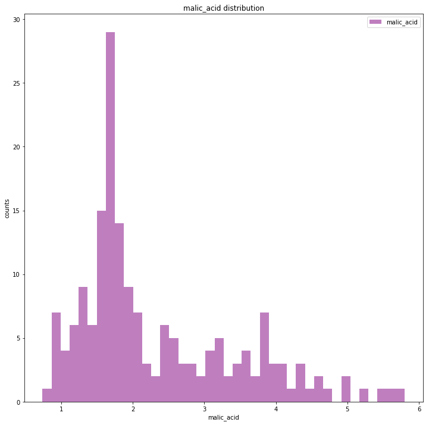

### Questions from the class
* identify (conditional) operators? - Jonathan - hold off for now
* implementing statistics lab - Jonathan

### Objectives
YWBAT 
* write functions to calculate statistics and apply those functions to a dataframe
* write functions to plot distributions
* interpret data based on the statistics
* use pandas to create new columns
* remove outliers from data by using pandas slicing 


```python
import numpy as np
import pandas as pd

from collections import defaultdict
from random import shuffle
from sklearn.datasets import load_wine
from pprint import pprint #prettyprint

import matplotlib.pyplot as plt
```


```python
attendees = ["joel", "bryan", "ahmed", "gina", "alex", "nick", "jonathan"]
shuffle(attendees)
attendees
```


    ['joel', 'jonathan', 'ahmed', 'bryan', 'alex', 'nick', 'gina']


### always do this step first when loading in a pre built dataset


```python
wine = load_wine() # calling the load function
```


```python
data = wine.data # x_vec-values
target = wine.target # y-values of our data set

columns = wine.feature_names + ["target"] # feature_names = names of columns 
columns
```


    ['alcohol',
     'malic_acid',
     'ash',
     'alcalinity_of_ash',
     'magnesium',
     'total_phenols',
     'flavanoids',
     'nonflavanoid_phenols',
     'proanthocyanins',
     'color_intensity',
     'hue',
     'od280/od315_of_diluted_wines',
     'proline',
     'target']


```python
full_data = np.column_stack((data, target)) # numpy method that vertically concatenates two arrays
full_data.shape
```


    (178, 14)


```python
df = pd.DataFrame(full_data, columns=columns)
df.head()
```


<div>
<style scoped>
    .dataframe tbody tr th:only-of-type {
        vertical-align: middle;
    }

    .dataframe tbody tr th {
        vertical-align: top;
    }

    .dataframe thead th {
        text-align: right;
    }
</style>
<table border="1" class="dataframe">
  <thead>
    <tr style="text-align: right;">
      <th></th>
      <th>alcohol</th>
      <th>malic_acid</th>
      <th>ash</th>
      <th>alcalinity_of_ash</th>
      <th>magnesium</th>
      <th>total_phenols</th>
      <th>flavanoids</th>
      <th>nonflavanoid_phenols</th>
      <th>proanthocyanins</th>
      <th>color_intensity</th>
      <th>hue</th>
      <th>od280/od315_of_diluted_wines</th>
      <th>proline</th>
      <th>target</th>
    </tr>
  </thead>
  <tbody>
    <tr>
      <th>0</th>
      <td>14.23</td>
      <td>1.71</td>
      <td>2.43</td>
      <td>15.6</td>
      <td>127.0</td>
      <td>2.80</td>
      <td>3.06</td>
      <td>0.28</td>
      <td>2.29</td>
      <td>5.64</td>
      <td>1.04</td>
      <td>3.92</td>
      <td>1065.0</td>
      <td>0.0</td>
    </tr>
    <tr>
      <th>1</th>
      <td>13.20</td>
      <td>1.78</td>
      <td>2.14</td>
      <td>11.2</td>
      <td>100.0</td>
      <td>2.65</td>
      <td>2.76</td>
      <td>0.26</td>
      <td>1.28</td>
      <td>4.38</td>
      <td>1.05</td>
      <td>3.40</td>
      <td>1050.0</td>
      <td>0.0</td>
    </tr>
    <tr>
      <th>2</th>
      <td>13.16</td>
      <td>2.36</td>
      <td>2.67</td>
      <td>18.6</td>
      <td>101.0</td>
      <td>2.80</td>
      <td>3.24</td>
      <td>0.30</td>
      <td>2.81</td>
      <td>5.68</td>
      <td>1.03</td>
      <td>3.17</td>
      <td>1185.0</td>
      <td>0.0</td>
    </tr>
    <tr>
      <th>3</th>
      <td>14.37</td>
      <td>1.95</td>
      <td>2.50</td>
      <td>16.8</td>
      <td>113.0</td>
      <td>3.85</td>
      <td>3.49</td>
      <td>0.24</td>
      <td>2.18</td>
      <td>7.80</td>
      <td>0.86</td>
      <td>3.45</td>
      <td>1480.0</td>
      <td>0.0</td>
    </tr>
    <tr>
      <th>4</th>
      <td>13.24</td>
      <td>2.59</td>
      <td>2.87</td>
      <td>21.0</td>
      <td>118.0</td>
      <td>2.80</td>
      <td>2.69</td>
      <td>0.39</td>
      <td>1.82</td>
      <td>4.32</td>
      <td>1.04</td>
      <td>2.93</td>
      <td>735.0</td>
      <td>0.0</td>
    </tr>
  </tbody>
</table>
</div>


## Write a function


```python
### write a function that takes in a load method 
### from sklearn datasets and returns a dataframe
### like the one above
def load_dataset(load_set=None):
    data_set = load_set() # data_set is a dictionary from load_set()
    data = data_set.data # x_vec-values
    target = data_set.target # y-values of our data set
    columns = data_set.feature_names + ["target"] # feature_names = names of columns 
    full_data = np.column_stack([data, target]) # list of numpy arrays
    df = pd.DataFrame(full_data, columns=columns) # create dataframes
    return df
```


```python
df = load_dataset(load_set=load_wine)
df.head()
```


<div>
<style scoped>
    .dataframe tbody tr th:only-of-type {
        vertical-align: middle;
    }

    .dataframe tbody tr th {
        vertical-align: top;
    }

    .dataframe thead th {
        text-align: right;
    }
</style>
<table border="1" class="dataframe">
  <thead>
    <tr style="text-align: right;">
      <th></th>
      <th>alcohol</th>
      <th>malic_acid</th>
      <th>ash</th>
      <th>alcalinity_of_ash</th>
      <th>magnesium</th>
      <th>total_phenols</th>
      <th>flavanoids</th>
      <th>nonflavanoid_phenols</th>
      <th>proanthocyanins</th>
      <th>color_intensity</th>
      <th>hue</th>
      <th>od280/od315_of_diluted_wines</th>
      <th>proline</th>
      <th>target</th>
    </tr>
  </thead>
  <tbody>
    <tr>
      <th>0</th>
      <td>14.23</td>
      <td>1.71</td>
      <td>2.43</td>
      <td>15.6</td>
      <td>127.0</td>
      <td>2.80</td>
      <td>3.06</td>
      <td>0.28</td>
      <td>2.29</td>
      <td>5.64</td>
      <td>1.04</td>
      <td>3.92</td>
      <td>1065.0</td>
      <td>0.0</td>
    </tr>
    <tr>
      <th>1</th>
      <td>13.20</td>
      <td>1.78</td>
      <td>2.14</td>
      <td>11.2</td>
      <td>100.0</td>
      <td>2.65</td>
      <td>2.76</td>
      <td>0.26</td>
      <td>1.28</td>
      <td>4.38</td>
      <td>1.05</td>
      <td>3.40</td>
      <td>1050.0</td>
      <td>0.0</td>
    </tr>
    <tr>
      <th>2</th>
      <td>13.16</td>
      <td>2.36</td>
      <td>2.67</td>
      <td>18.6</td>
      <td>101.0</td>
      <td>2.80</td>
      <td>3.24</td>
      <td>0.30</td>
      <td>2.81</td>
      <td>5.68</td>
      <td>1.03</td>
      <td>3.17</td>
      <td>1185.0</td>
      <td>0.0</td>
    </tr>
    <tr>
      <th>3</th>
      <td>14.37</td>
      <td>1.95</td>
      <td>2.50</td>
      <td>16.8</td>
      <td>113.0</td>
      <td>3.85</td>
      <td>3.49</td>
      <td>0.24</td>
      <td>2.18</td>
      <td>7.80</td>
      <td>0.86</td>
      <td>3.45</td>
      <td>1480.0</td>
      <td>0.0</td>
    </tr>
    <tr>
      <th>4</th>
      <td>13.24</td>
      <td>2.59</td>
      <td>2.87</td>
      <td>21.0</td>
      <td>118.0</td>
      <td>2.80</td>
      <td>2.69</td>
      <td>0.39</td>
      <td>1.82</td>
      <td>4.32</td>
      <td>1.04</td>
      <td>2.93</td>
      <td>735.0</td>
      <td>0.0</td>
    </tr>
  </tbody>
</table>
</div>


### Let's look at a description


```python
pprint(wine.DESCR)
```

    ('.. _wine_dataset:\n'
     '\n'
     'Wine recognition dataset\n'
     '------------------------\n'
     '\n'
     '**Data Set Characteristics:**\n'
     '\n'
     '    :Number of Instances: 178 (50 in each of three classes)\n'
     '    :Number of Attributes: 13 numeric, predictive attributes and the class\n'
     '    :Attribute Information:\n'
     ' \t\t- Alcohol\n'
     ' \t\t- Malic acid\n'
     ' \t\t- Ash\n'
     '\t\t- Alcalinity of ash  \n'
     ' \t\t- Magnesium\n'
     '\t\t- Total phenols\n'
     ' \t\t- Flavanoids\n'
     ' \t\t- Nonflavanoid phenols\n'
     ' \t\t- Proanthocyanins\n'
     '\t\t- Color intensity\n'
     ' \t\t- Hue\n'
     ' \t\t- OD280/OD315 of diluted wines\n'
     ' \t\t- Proline\n'
     '\n'
     '    - class:\n'
     '            - class_0\n'
     '            - class_1\n'
     '            - class_2\n'
     '\t\t\n'
     '    :Summary Statistics:\n'
     '    \n'
     '    ============================= ==== ===== ======= =====\n'
     '                                   Min   Max   Mean     SD\n'
     '    ============================= ==== ===== ======= =====\n'
     '    Alcohol:                      11.0  14.8    13.0   0.8\n'
     '    Malic Acid:                   0.74  5.80    2.34  1.12\n'
     '    Ash:                          1.36  3.23    2.36  0.27\n'
     '    Alcalinity of Ash:            10.6  30.0    19.5   3.3\n'
     '    Magnesium:                    70.0 162.0    99.7  14.3\n'
     '    Total Phenols:                0.98  3.88    2.29  0.63\n'
     '    Flavanoids:                   0.34  5.08    2.03  1.00\n'
     '    Nonflavanoid Phenols:         0.13  0.66    0.36  0.12\n'
     '    Proanthocyanins:              0.41  3.58    1.59  0.57\n'
     '    Colour Intensity:              1.3  13.0     5.1   2.3\n'
     '    Hue:                          0.48  1.71    0.96  0.23\n'
     '    OD280/OD315 of diluted wines: 1.27  4.00    2.61  0.71\n'
     '    Proline:                       278  1680     746   315\n'
     '    ============================= ==== ===== ======= =====\n'
     '\n'
     '    :Missing Attribute Values: None\n'
     '    :Class Distribution: class_0 (59), class_1 (71), class_2 (48)\n'
     '    :Creator: R.A. Fisher\n'
     '    :Donor: Michael Marshall (MARSHALL%PLU@io.arc.nasa.gov)\n'
     '    :Date: July, 1988\n'
     '\n'
     'This is a copy of UCI ML Wine recognition datasets.\n'
     'https://archive.ics.uci.edu/ml/machine-learning-databases/wine/wine.data\n'
     '\n'
     'The data is the results of a chemical analysis of wines grown in the same\n'
     'region in Italy by three different cultivators. There are thirteen '
     'different\n'
     'measurements taken for different constituents found in the three types of\n'
     'wine.\n'
     '\n'
     'Original Owners: \n'
     '\n'
     'Forina, M. et al, PARVUS - \n'
     'An Extendible Package for Data Exploration, Classification and '
     'Correlation. \n'
     'Institute of Pharmaceutical and Food Analysis and Technologies,\n'
     'Via Brigata Salerno, 16147 Genoa, Italy.\n'
     '\n'
     'Citation:\n'
     '\n'
     'Lichman, M. (2013). UCI Machine Learning Repository\n'
     '[http://archive.ics.uci.edu/ml]. Irvine, CA: University of California,\n'
     'School of Information and Computer Science. \n'
     '\n'
     '.. topic:: References\n'
     '\n'
     '  (1) S. Aeberhard, D. Coomans and O. de Vel, \n'
     '  Comparison of Classifiers in High Dimensional Settings, \n'
     '  Tech. Rep. no. 92-02, (1992), Dept. of Computer Science and Dept. of  \n'
     '  Mathematics and Statistics, James Cook University of North Queensland. \n'
     '  (Also submitted to Technometrics). \n'
     '\n'
     '  The data was used with many others for comparing various \n'
     '  classifiers. The classes are separable, though only RDA \n'
     '  has achieved 100% correct classification. \n'
     '  (RDA : 100%, QDA 99.4%, LDA 98.9%, 1NN 96.1% (z-transformed data)) \n'
     '  (All results using the leave-one-out technique) \n'
     '\n'
     '  (2) S. Aeberhard, D. Coomans and O. de Vel, \n'
     '  "THE CLASSIFICATION PERFORMANCE OF RDA" \n'
     '  Tech. Rep. no. 92-01, (1992), Dept. of Computer Science and Dept. of \n'
     '  Mathematics and Statistics, James Cook University of North Queensland. \n'
     '  (Also submitted to Journal of Chemometrics).\n')


```python
### calculate the mean of malic acid without using .mean() or np.mean()
summ = np.sum(df["malic_acid"])
counts = df["malic_acid"].shape[0]
mean_malic_acid = 1.0*summ/counts
mean_malic_acid, np.mean(df["malic_acid"])
```


    (2.3363483146067416, 2.336348314606741)


```python
### calculate the standard deviation of malic acid without using .std() or np.std()
mean = np.sum(df["malic_acid"])/len(df["malic_acid"])
counts = len(df["malic_acid"])
distances_squared = (df["malic_acid"] - mean)**2
sum_dist_squared = np.sum(distances_squared)
mean_dist_squred = sum_dist_squared/counts


std_malic_acid = np.sqrt(mean_dist_squred)
std_malic_acid, np.std(df["malic_acid"])
```


    (1.1140036269797893, 1.1140036269797895)


```python
### write functions that takes in a list (array) and returns the mean and standard deviation
def mean_function(arr):
    summ = np.sum(arr)
    counts = arr.shape[0]
    mean = 1.0*summ/counts
    return mean

def std_function(arr):
    mean = mean_function(arr)
    counts = len(arr)
    distances_squared = (arr - mean)**2
    sum_dist_squared = np.sum(distances_squared)
    mean_dist_squred = sum_dist_squared/counts
    std_malic_acid = np.sqrt(mean_dist_squred)
    return std_malic_acid
```


```python
mean_function(df["malic_acid"]), std_function(df["malic_acid"])
```


    (2.3363483146067416, 1.1140036269797893)


```python
plt.hist(df["malic_acid"], bins=20)
```


    (array([ 8., 10., 15., 44., 23., 10.,  8.,  8.,  5.,  9.,  5.,  6., 10.,
             4.,  4.,  3.,  2.,  1.,  1.,  2.]),
     array([0.74 , 0.993, 1.246, 1.499, 1.752, 2.005, 2.258, 2.511, 2.764,
            3.017, 3.27 , 3.523, 3.776, 4.029, 4.282, 4.535, 4.788, 5.041,
            5.294, 5.547, 5.8  ]),
     <a list of 20 Patch objects>)





### Plot Distribution


```python
### plot the distribution of alcohol content
### code goes here
plt.figure(figsize=(8, 8))
plt.hist(df["alcohol"], label="alcohol", alpha=0.5, bins=20)
plt.xlabel("alcohol content")
plt.ylabel("counts")
plt.title("alcohol content distribution")
plt.legend()
plt.show()
```





```python
### write a function that takes in a dataframe and column name and returns a histogram
### the histogram must have labeled axes and a title

def histogram(ddddf, cname, figsize=(8, 8), alpha=0.5, bins=20, color='blue'):
    plt.figure(figsize=figsize)
    plt.hist(ddddf[cname], color=color, label=cname, alpha=alpha, bins=bins)
    plt.xlabel(cname)
    plt.ylabel("counts")
    plt.title("{} distribution".format(cname))
    plt.legend()
    plt.show()
    pass
```


```python
histogram(ddddf=df, color='purple', figsize=(12, 12), alpha=0.5, bins=40 , cname="malic_acid")
```





### Creating columns with pandas


```python
### create a new column that is the ratio of ash to malic acid and name it
### ash_to_malic_acid

# code goes here
df["ash_to_malic_acid"] = df["ash"]/df["malic_acid"]
df.head(3)
```


<div>
<style scoped>
    .dataframe tbody tr th:only-of-type {
        vertical-align: middle;
    }

    .dataframe tbody tr th {
        vertical-align: top;
    }

    .dataframe thead th {
        text-align: right;
    }
</style>
<table border="1" class="dataframe">
  <thead>
    <tr style="text-align: right;">
      <th></th>
      <th>alcohol</th>
      <th>malic_acid</th>
      <th>ash</th>
      <th>alcalinity_of_ash</th>
      <th>magnesium</th>
      <th>total_phenols</th>
      <th>flavanoids</th>
      <th>nonflavanoid_phenols</th>
      <th>proanthocyanins</th>
      <th>color_intensity</th>
      <th>hue</th>
      <th>od280/od315_of_diluted_wines</th>
      <th>proline</th>
      <th>target</th>
      <th>ash_to_malic_acid</th>
    </tr>
  </thead>
  <tbody>
    <tr>
      <th>0</th>
      <td>14.23</td>
      <td>1.71</td>
      <td>2.43</td>
      <td>15.6</td>
      <td>127.0</td>
      <td>2.80</td>
      <td>3.06</td>
      <td>0.28</td>
      <td>2.29</td>
      <td>5.64</td>
      <td>1.04</td>
      <td>3.92</td>
      <td>1065.0</td>
      <td>0.0</td>
      <td>1.421053</td>
    </tr>
    <tr>
      <th>1</th>
      <td>13.20</td>
      <td>1.78</td>
      <td>2.14</td>
      <td>11.2</td>
      <td>100.0</td>
      <td>2.65</td>
      <td>2.76</td>
      <td>0.26</td>
      <td>1.28</td>
      <td>4.38</td>
      <td>1.05</td>
      <td>3.40</td>
      <td>1050.0</td>
      <td>0.0</td>
      <td>1.202247</td>
    </tr>
    <tr>
      <th>2</th>
      <td>13.16</td>
      <td>2.36</td>
      <td>2.67</td>
      <td>18.6</td>
      <td>101.0</td>
      <td>2.80</td>
      <td>3.24</td>
      <td>0.30</td>
      <td>2.81</td>
      <td>5.68</td>
      <td>1.03</td>
      <td>3.17</td>
      <td>1185.0</td>
      <td>0.0</td>
      <td>1.131356</td>
    </tr>
  </tbody>
</table>
</div>


